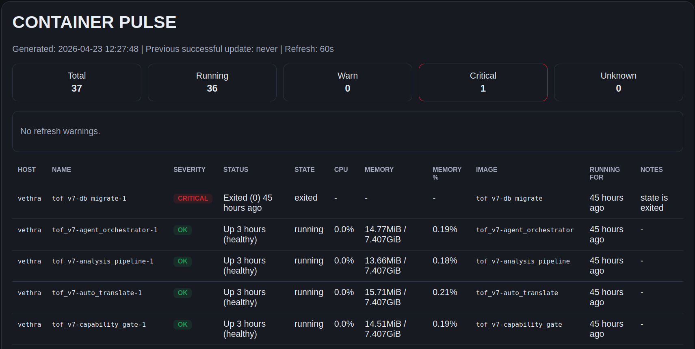

# tof_container_pulse

[](https://github.com/IMaugrenI/tof_container_pulse/actions/workflows/ci.yml)
[](https://github.com/IMaugrenI/tof_container_pulse/actions/workflows/smoke.yml)

<p align="center">
  
</p>

**Local static Pulse Suite for Docker, hardware, ports, storage, services, and security orientation.**

Generate local static status pages — read-only, local-first, no database, no cloud, no auto-fix.



*A real local host view showing container health, warning thresholds, and critical states in one page.*

One host. Six pages. One local view.

## What this repo is

`tof_container_pulse` is a small local Observe repo.

It generates static HTML pages so you can answer one question fast:

> Is everything okay right now?

The current suite generates:

- `pulse.html` — Container Pulse
- `hardware.html` — Hardware Pulse
- `ports.html` — Port Pulse
- `storage.html` — Storage Pulse
- `services.html` — Services Pulse
- `security.html` — Security Pulse

Each generated page shows clear badges near the navigation:

- **Platform** — Linux, macOS, or Windows context
- **Collector** — Deep, Baseline, Configured, or Docker CLI
- **Mode** — Read-only

## Platform support

Pulse Suite supports Linux, macOS, and Windows.

Linux remains the deepest supported platform. macOS and Windows use calm baseline adapters where OS-specific deep signals are not available yet.

| Page | Linux | macOS | Windows |
| --- | --- | --- | --- |
| Container Pulse | Docker CLI | Docker CLI | Docker CLI |
| Hardware Pulse | deep collector | baseline adapter | baseline adapter |
| Port Pulse | `ss` / `netstat` | `netstat` | PowerShell / `netstat` |
| Storage Pulse | mount, inode, lsblk details | baseline volume usage | baseline volume usage |
| Services Pulse | configured checks | configured checks | configured checks |
| Security Pulse | deep local collector | baseline safety orientation | baseline safety orientation |

See `PLATFORM_SUPPORT.md` for the detailed matrix and safety boundaries.

## Safety boundary

Pulse Suite is local, static, read-only, and advisory.

It does not:

- restart containers
- change Docker settings
- change firewall rules
- change SSH settings
- change users or groups
- change services
- clean or repair storage
- run external scans
- auto-fix anything
- require a database
- require a cloud service

## Who it is for

This repo is for self-hosters, local operators, and small teams who want simple host visibility without adopting a larger monitoring stack.

## What it is not

This repo is not a control plane, not a cloud service, not a time-series database, and not a hidden automation layer.

## Features

- Linux, macOS, Windows
- static HTML output
- six Pulse Suite pages
- read-only Docker CLI access when available
- no Docker SDK required
- configurable warning thresholds
- optional watch loop
- optional multi-host Docker context view for Container Pulse
- German/English UI switching
- Light/Dark UI switching
- no database
- no cloud

## Requirements

- Python 3.9+
- Docker CLI in `PATH` for Container Pulse Docker details
- Docker daemon or Docker Desktop running for live Docker container data

Docker is not required for the non-Docker baseline pages to render. Without Docker, the generated pages should still render and show unavailable Docker data calmly.

Optional:

- `PyYAML` for YAML config loading
- `psutil` for richer cross-platform hardware/storage data on macOS and Windows

## Quick start

`--once` generates all six HTML pages and opens `pulse.html` automatically in your default browser.
Use `--no-open` if you only want to generate files.

### Linux

```bash
python3 run.py --once
```

or

```bash
./scripts/linux/start_here.sh
```

### macOS

```bash
python3 run.py --once
```

or

```bash
./scripts/macos/start_here.command
```

### Windows (PowerShell)

```powershell
py run.py --once
```

or

```powershell
./scripts/windows/start_here.ps1
```

Generated files:

```text
pulse.html
hardware.html
ports.html
storage.html
services.html
security.html
```

## Watch mode

### Linux / macOS

```bash
python3 run.py --watch 60
```

### Windows (PowerShell)

```powershell
py run.py --watch 60
```

## Quality checks

Run the same smoke check locally that GitHub Actions uses:

```bash
python scripts/smoke_check.py
```

The smoke check compiles Python files, generates all six HTML pages, verifies that pages look rendered, and checks that platform/collector/read-only badges are present.

See `QUALITY.md` for details.

## Config

Defaults are built in.

Copy `config.example.yaml` to `config.yaml` if you want custom thresholds.
YAML loading is optional and uses `PyYAML` from `requirements.txt`.

Install optional YAML support:

```bash
pip install -r requirements.txt
```

Use a config file:

```bash
python3 run.py --once --config config.yaml
```

Write to another output path:

```bash
python3 run.py --once --output pulse.html
```

## Multi-host mode

Multi-host is optional.
If you do nothing, the tool stays in normal single-host mode.

A neutral template is included:

```text
multi_host.example.yaml
```

Use it only if you actually want a combined view across multiple Docker contexts.

### How to use it

1. copy `multi_host.example.yaml` to `multi_host.yaml`
2. fill in your real Docker contexts
3. run:

```bash
python3 run.py --once --config multi_host.yaml
```

### Example

```yaml
hosts:
  - name: local
    docker_context: default
  - name: nas
    docker_context: nas
```

In multi-host mode, Container Pulse keeps the same logic and style, but adds a `Host` column and merges all configured Docker contexts into one page.

## Severity model

- `ok` = running or within thresholds
- `warn` = should be reviewed
- `critical` = important problem signal
- `unknown` = state or live data could not be determined cleanly

## Local path and safety note

Pulse Suite is a local read-only observer, but it can write output and state files to custom paths.
If you change `--output`, `--state-file`, `--template`, or `--config`, use only paths you understand and control.

For safe examples and path guidance, see:
- `docs/10_safe_paths_and_local_usage.md`

For public screenshots and issue hygiene, see:
- `docs/11_public_screenshot_safety.md`
- `SECURITY.md`

For the multi-page direction, see:
- `docs/12_pulse_suite_roadmap.md`

For platform support, see:
- `PLATFORM_SUPPORT.md`

For quality checks, see:
- `QUALITY.md`

## Notes

- single-host by default
- optional multi-host via Docker contexts
- read-only by design
- no time-series history
- no container restart or control actions
- platform-specific unavailable values should render as optional, unknown, or N/A instead of crashing
