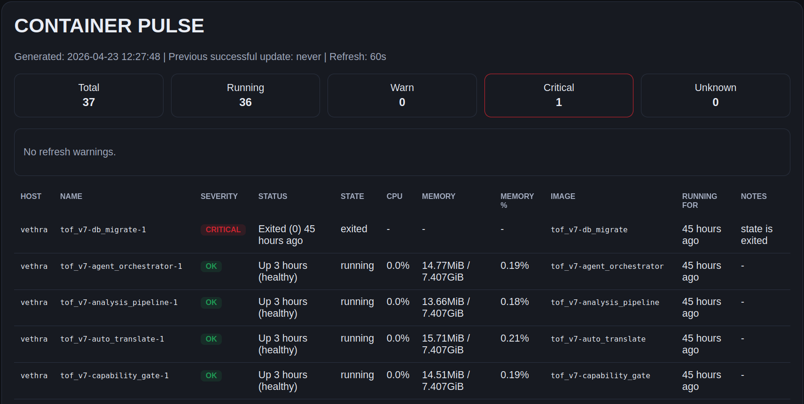

# tof_container_pulse

<p align="center">
  
</p>

> Die englische Hauptfassung liegt in `README.md`.

**Lokaler Docker-Host-Status auf einen Blick**

Erzeuge eine einfache statische Statusseite aus Docker-CLI-Daten — read-only, local-first, keine Datenbank, keine Cloud.



*Ein echter lokaler Host-Blick mit Container-Gesundheit, Warnschwellen und kritischen Zuständen auf einer Seite.*

Ein Host. Eine Seite. Ein Blick.

`tof_container_pulse` ist ein kleines lokales Dashboard für Docker-Hosts.
Es erzeugt eine statische `pulse.html`, damit du eine Frage schnell beantworten kannst:

> Ist gerade alles in Ordnung?

## Was dieses Repo ist

Dieses Repository ist das öffentliche **Observe**-Repo in der Produktlinie.

## Für wen es gedacht ist

Dieses Repo ist für Self-Hoster, lokale Operator und kleine Teams, die einfache Docker-Host-Sichtbarkeit wollen, ohne einen größeren Monitoring-Stack einzuführen.

## Was es nicht ist

Dieses Repo ist kein Control Plane, kein Cloud-Dienst und keine versteckte Automationsschicht.

## Wohin du als Nächstes gehen kannst

- `tof-showcase` — öffentlicher Architektur- und Produktlinien-Überblick
- `tof_local_knowledge` — grounded lokale Knowledge-Workflows
- `tof_local_builder` — kontrollierte lokale Build-Workflows

## Rolle in der öffentlichen Produktlinie

Beobachten (Systemzustand sichtbar machen)

### Funktioniert allein
Ja.

### Integration
Keine (bewusst nur Beobachtung)

### Nicht gedacht für
- andere Tools zu steuern
- automatisierte Prozesse auszulösen
- Teil einer Verarbeitungskette zu werden

## Features

- Linux, macOS, Windows
- read-only Docker-CLI-Zugriff
- kein Docker SDK nötig
- konfigurierbare Warnschwellen
- optionaler Watch-Loop
- optionale Multi-Host-Sicht über Docker-Contexts
- statische HTML-Ausgabe
- keine Datenbank
- keine Cloud

## Voraussetzungen

- Python 3.9+
- Docker CLI in `PATH`
- Docker Daemon oder Docker Desktop läuft

## Schnellstart

`--once` erzeugt `pulse.html` und öffnet sie automatisch im Standardbrowser.
Nutze `--no-open`, wenn du nur die Datei erzeugen willst.

### Linux

```bash
python3 run.py --once
```

oder

```bash
./scripts/linux/start_here.sh
```

### macOS

```bash
python3 run.py --once
```

oder

```bash
./scripts/macos/start_here.command
```

### Windows (PowerShell)

```powershell
py run.py --once
```

oder

```powershell
./scripts/windows/start_here.ps1
```

## Watch-Modus

### Linux / macOS

```bash
python3 run.py --watch 60
```

### Windows (PowerShell)

```powershell
py run.py --watch 60
```

## Konfiguration

Standardwerte sind eingebaut.

Kopiere `config.example.yaml` nach `config.yaml`, wenn du eigene Schwellen willst.
YAML ist optional und nutzt `PyYAML` aus `requirements.txt`.

Optionale YAML-Unterstützung installieren:

```bash
pip install -r requirements.txt
```

Mit Config-Datei starten:

```bash
python run.py --once --config config.yaml
```

In anderen Ausgabepfad schreiben:

```bash
python run.py --once --output pulse.html
```

## Multi-Host-Modus

Multi-Host ist optional.
Wenn du nichts tust, bleibt das Tool im normalen Single-Host-Modus.

Eine neutrale Vorlage ist enthalten:

```text
multi_host.example.yaml
```

Nutze sie nur, wenn du wirklich eine kombinierte Sicht über mehrere Docker-Contexts willst.

### Nutzung

1. `multi_host.example.yaml` nach `multi_host.yaml` kopieren
2. echte Docker-Contexts eintragen
3. starten:

```bash
python run.py --once --config multi_host.yaml
```

### Beispiel

```yaml
hosts:
  - name: local
    docker_context: default
  - name: nas
    docker_context: nas
```

Im Multi-Host-Modus bleibt Logik und Stil gleich, aber die Seite ergänzt eine `Host`-Spalte und führt alle konfigurierten Hosts auf einer Seite zusammen.

## Severity-Modell

- `ok` = läuft und liegt innerhalb der Schwellen
- `warn` = läuft, aber CPU oder RAM liegt über der Schwelle
- `critical` = Container-Zustand ist nicht gesund
- `unknown` = Zustand oder Live-Stats konnten nicht sauber bestimmt werden

## Hinweis zu lokalen Pfaden und Sicherheit

Container Pulse ist ein lokaler read-only Beobachter, kann aber Ausgabedateien und Statusdateien in benutzerdefinierte Pfade schreiben.
Wenn du `--output`, `--state-file`, `--template` oder `--config` änderst, nutze nur Pfade, die du verstehst und kontrollierst.

Für sichere Beispiele und Pfad-Hinweise siehe:
- `docs/10_safe_paths_and_local_usage.md`

## Hinweise

- standardmäßig Single-Host
- optional Multi-Host über Docker-Contexts
- bewusst read-only
- keine Zeitreihen-Historie
- keine Restart- oder Kontrollaktionen
